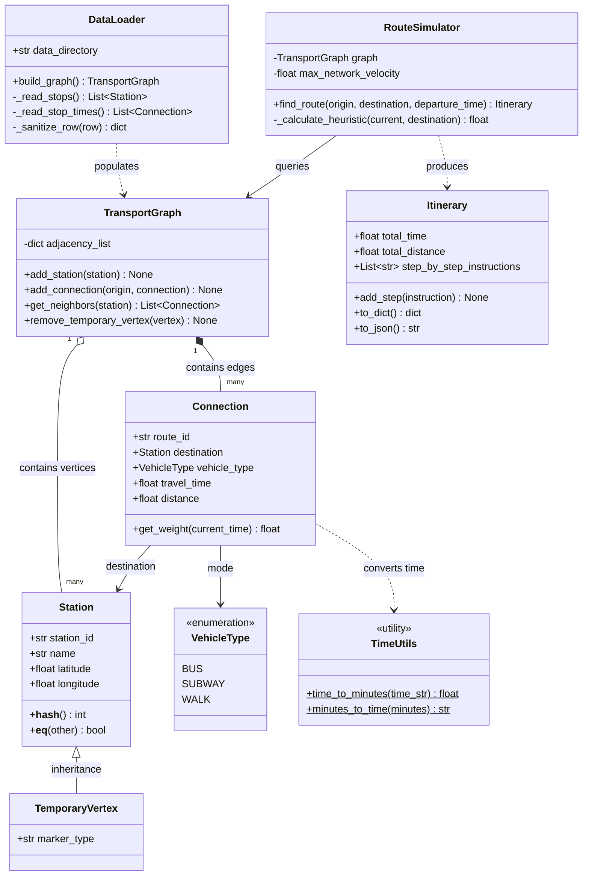

# Route System Architecture - Class Diagram

Class diagram for the core in-memory graph routing engine:

```mermaid
classDiagram
    class VehicleType {
        <<enumeration>>
        BUS
        SUBWAY
        WALK
    }

    class Station {
        +str station_id
        +str name
        +float latitude
        +float longitude
        +__hash__() int
        +__eq__(other) bool
    }

    class TemporaryVertex {
        +str marker_type
    }

    class Connection {
        +str route_id
        +Station destination
        +VehicleType vehicle_type
        +float travel_time
        +float distance
        +get_weight(current_time) float
    }

    class TransportGraph {
        -dict adjacency_list
        +add_station(station) None
        +add_connection(origin, connection) None
        +get_neighbors(station) List~Connection~
        +remove_temporary_vertex(vertex) None
    }

    class DataLoader {
        +str data_directory
        +build_graph() TransportGraph
        -_read_stops() List~Station~
        -_read_stop_times() List~Connection~
        -_sanitize_row(row) dict
    }

    class Itinerary {
        +float total_time
        +float total_distance
        +List~str~ step_by_step_instructions
        +add_step(instruction) None
        +to_dict() dict
        +to_json() str
    }

    class TimeUtils {
        <<utility>>
        +time_to_minutes(time_str)$ float
        +minutes_to_time(minutes)$ str
    }

    class RouteSimulator {
        -TransportGraph graph
        -float max_network_velocity
        +find_route(origin, destination, departure_time) Itinerary
        -_calculate_heuristic(current, destination) float
    }

    %% Relationships
    Station <|-- TemporaryVertex : inheritance
    Connection --> Station : destination
    Connection --> VehicleType : mode
    TransportGraph "1" o-- "many" Station : contains vertices
    TransportGraph "1" *-- "many" Connection : contains edges
    RouteSimulator --> TransportGraph : queries
    RouteSimulator ..> Itinerary : produces
    DataLoader ..> TransportGraph : populates
    Connection ..> TimeUtils : converts time
```
