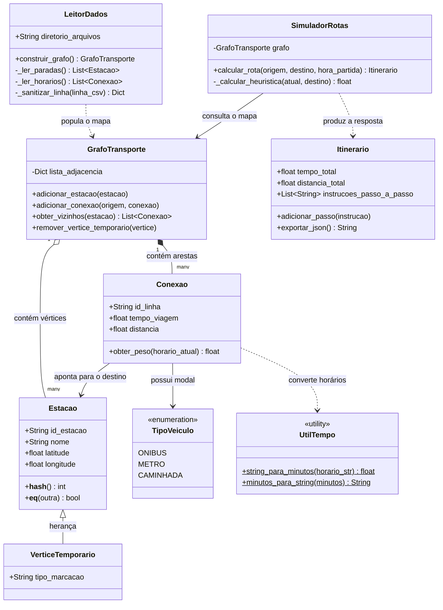

# Arquitetura do Sistema de Rotas

Abaixo está a modelagem de classes do nosso motor de grafos:

```mermaid
classDiagram
    class TipoVeiculo {
        <<enumeration>>
        ONIBUS
        METRO
        CAMINHADA
    }

    class Estacao {
        +String id_estacao
        +String nome
        +float latitude
        +float longitude
        +__hash__() int
        +__eq__(outra) bool
    }

    class VerticeTemporario {
        +String tipo_marcacao
    }

    class Conexao {
        +String id_linha
        +float tempo_viagem
        +float distancia
        +obter_peso(horario_atual) float
    }

    class GrafoTransporte {
        -Dict lista_adjacencia
        +adicionar_estacao(estacao)
        +adicionar_conexao(origem, conexao)
        +obter_vizinhos(estacao) List~Conexao~
        +remover_vertice_temporario(vertice)
    }

    class LeitorDados {
        +String diretorio_arquivos
        +construir_grafo() GrafoTransporte
        -_ler_paradas() List~Estacao~
        -_ler_horarios() List~Conexao~
        -_sanitizar_linha(linha_csv) Dict
    }

    class Itinerario {
        +float tempo_total
        +float distancia_total
        +List~String~ instrucoes_passo_a_passo
        +adicionar_passo(instrucao)
        +exportar_json() String
    }

    class UtilTempo {
        <<utility>>
        +string_para_minutos(horario_str)$ float
        +minutos_para_string(minutos)$ String
    }

    class SimuladorRotas {
        -GrafoTransporte grafo
        +calcular_rota(origem, destino, hora_partida) Itinerario
        -_calcular_heuristica(atual, destino) float
    }

    %% Relacionamentos
    Estacao <|-- VerticeTemporario : herança
    Conexao --> Estacao : aponta para o destino
    Conexao --> TipoVeiculo : possui modal
    GrafoTransporte "1" o-- "many" Estacao : contém vértices
    GrafoTransporte "1" *-- "many" Conexao : contém arestas
    SimuladorRotas --> GrafoTransporte : consulta o mapa
    SimuladorRotas ..> Itinerario : produz a resposta
    LeitorDados ..> GrafoTransporte : popula o mapa
    Conexao ..> UtilTempo : converte horários
```